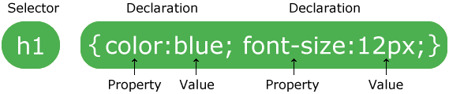

# CSS and Styling


-
-
## Lecture Overview
* What is CSS?
* CSS Syntax
* How to insert CSS
*


-
-
### What is CSS and why do we use it?
* CSS stands for Cascading Style Sheets. They are stored in external CSS files
* CSS describes how HTML elements are to be displayed on screen, paper, or in other media
* CSS saves a lot of work. It can control the layout of multiple web pages all at once


-
-
### CSS Syntax



* CSS selectors points to the HTML elements you want to style
* A CSS declaration always ends with a semicolon, and declaration blocks are surrounded by curly braces
* A property indicates which stylistic features you want to change. Ex: Font, width, background color
* A value indicated how you want to change the stylistic feature
* Discussion point 1A.3


-
#### CSS Selectors
* CSS selectors are used to select HTML elements based on their element name, id, class, attribute, and more


-
#### Element Selectors
* The element selector selects elements based on the element name
* The code below selects all <p> elements on a page and makes them center aligned and red

```CSS
  p {
    text-align: center;
    color: yellow;
  }
```

-
#### Id Selectors
* The id selector uses the id attribute of an HTML element to select a specific element
* The id of an element should be unique within a page, so the id selector is used to select one element
* Use a hash (#) followed by the id of the element

```CSS
  #headshot {
    background: green;
    border: 1px solid red;
  }
```


-
#### Class Selectors
* The class selector selects elements with a specific class attribute
* Use a period (.) character, followed by the name of the class
* Can appear multiple times within a page, unlike id selectors which only appear once

```CSS
  .projects {
    text-align: center;
  }
```


-
#### Grouping Selectors
* If you have multiple elements with the same style, you can group the selectors with a comma
* This helps to minimize code

```CSS
  h1, h2, p {
  text-align: center;
  color: red;
  }
```

-
#### Descendent Selectors
* Descendent selectors (or descendent combinator) allow you to combine two or more selectors so you can be more specific
* Elements matched by the second selector are selected if they have an ancestor element matching the first selector
* This relationship is created with a space between selectors

```CSS
  ul li {
    margin: 10px;
  }
```


-
-
### How to insert CSS

There are three ways to insert CSS
* External Style Sheet
* Internal Style Sheet
* Inline style


-
#### External Style Sheet
* Able to change the look of a page with just one file
* Each page must include a reference to the external style sheet file inside the <link> element. The <link> element goes inside the <head> section
* The style sheet file must be saved with a .css extension.
* Easy to maintain and saves time

```HTML
  <head>
  <link rel="stylesheet" type="text/css" href="mystyle.css">
  </head>
```

-
#### Internal Style Sheet
* An internal stylesheet holds the CSS code for the webpage in the <head> section of the particular file
* Only affects the page the code is inserted into
* Not reusable

```HTML
  <head>
    <style>
        body { background-color: blue; }
        p { color: white; }
    </style>
  </head>
```

-
#### Inline Style
* The inline style is added as an HTML attribute
* Good for an individual CSS change that you do not use repeatedly throughout the site
* This is not a recommended approach

```HTML
  <h1 style="font-size: 48px;">My headline</h1>
```

-
-
### CSS Specificity
* If two CSS selectors apply to the same element, the one with higher specificity wins
* There are 4 categories which define the specificity level of a selector
* Each category has a certain number of points


-
#### Inline styles
* An inline style is directly attached to the element that is styled
* Has a value of 1000 points

```HTML
  <h1 style="color: #ffffff;">
```

-
#### IDs
* A unique identifier for the page elements using (#)
* Has a value of 100 points

```CSS
  #headshot {
    background: green;
    border: 1px solid red;
  }
```

-
#### Classes, attributes, and pseudo-classes
* This category includes .classes, [attributes] and pseudo-classes such as :hover, :focus etc.
* Has a value of 10 points

```CSS
  .project{
  font-family: Tahoma;
  font color: #4F0E42;
  }
```
```CSS
  a:hover{
  color: purple;
  }
```

-
#### Elements and pseudo-elements
* This includes element names and pseudo-elements, such as h1, div, :before and :after.
* Has a value of 1 point

```CSS
  h2{
  font-family: Comic Sans, sans-serif;
  font color: #DFAEB4;
  }
```

-
#### Specificity Chart


-
-


-
-
## Lecture Summary
* Topic 1 Summary
* Topic 2 Summary
* Topic 3 Summary
